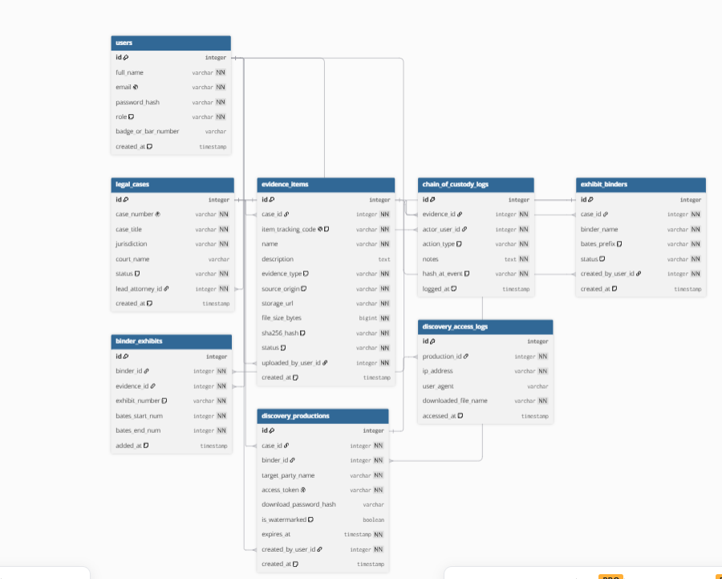

Project 2:

Digital Evidence Vault & Chain-of-Custody Managment System

1. users

id: PK

full_name

email

password_hash

role

status

profile_picture_url

is_email_verified

verification_token

verification_token_expiry

password_reset_token

password_reset_token_expiry

created_at

updated_at

2. legal_cases

id: PK

case_number

case_title

case_type

lead_attorney_id: FK

client_id: FK

opposing_party_name

opposing_counsel_name

opposing_counsel_email

status

created_at

updated_at

3. evidence_items

id: PK

case_id: FK

item_tracking_code

name

description

evidence_type

source_origin

seizing_officer_name

officer_badge_number

law_enforcement_agency

police_incident_report_num

storage_url

file_size_bytes

sha256_hash

status

uploaded_by_user_id: FK

created_at

updated_at

4. chain_of_custody_logs

id: PK

evidence_id: FK

actor_user_id: FK

action_type

notes

hash_at_event

logged_at

5. custody_reservations

id: PK

evidence_id: FK

examiner_id: FK

start_time

end_time

status

notes

created_at

updated_at

6. exhibit_binders

id: PK

case_id: FK

binder_name

bates_prefix

status

created_by_user_id: FK

created_at

updated_at

7. binder_exhibits

id: PK

binder_id: FK

evidence_id: FK

exhibit_number

bates_start_num

bates_end_num

added_at

8. discovery_productions

id: PK

case_id: FK

binder_id: FK

target_party_name

access_token

download_password_hash

is_watermarked

expires_at

created_by_user_id: FK

created_at

9. discovery_access_logs

id: PK

production_id: FK

ip_address

user_agent

downloaded_file_name

accessed_at

1.) Users--> legal cases

one user can have many legal cases

for example :

legal_cases.lead_attorney_id --> user.id

legal_cases.client_id --> users.id

one lead attorny can manage many legal cases

one client can have one or more legal cases assigned to them

why the reason for the users type to authorize who can read and who can edit and upload accordingly

2.) legal_cases --> evidence_items(one to many)

Foreign key: evidnece_items.case_id --> legal_cases.id

one legal case contains many evidence items each peice of evidence belongs to one case
many evidence to a case connected throught the case id to connected to the evidenct item.case id

STILL UNDERCOSIDERATIONS!!!

anything uploaded to the evidence depends on the user type for example a clinet may have limited upload capacity and some may have other privilages still under consideration

3.) evidence_items --> chain_of_custody_logs

one to many relationship

chain_id --> evidence_id

one piece of evidence accumulates many chronological log entires over time .

this piece of evidence can be used for checking again and again reexamine and to be used so the many happens here

4.) evidence_items --> custody_reservations

custody_id--> evidence_id

custody_reservations.examiner_id --> users.id

one piece of evidence can have multiple scheduled checkout reservations over its lifetime
example bookekd for analysis or booked for another thing in another day and so on

5.)

