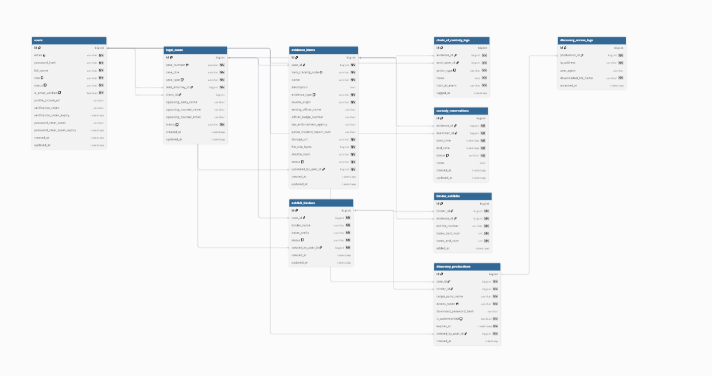

# VeritasVault: Digital Evidence Vault & Chain-of-Custody Management System


[](https://spring.io/projects/spring-boot)
[](https://www.oracle.com/java/)
[](https://www.postgresql.org/)
[](https://spring.io/projects/spring-security)
[](http://localhost:8085/swagger-ui/index.html)

**VeritasVault** is an enterprise-grade digital forensics vault and legal custody lifecycle platform built for law firms, law enforcement forensics labs, and judicial counsel. The platform guarantees strict forensic integrity for digital assets (device extractions, video/audio dumps, network logs) through streaming cryptographic verification, immutable chain-of-custody ledgers, laboratory booking conflict detection, trial exhibit Bates stamping, and secure time-limited discovery productions.
 
# introduciton:
1. The O.J. Simpson Murder Trial (1995)
2. United States v. Ross Ulbricht (The Silk Road Trial)
3. Qualcomm Inc. v. Broadcom Corp. (The $8.5M Discovery Disaster)
4. Commonwealth of Massachusetts v. Karen Read (2024)
5. The Annie Dookhan / Hinton State Laboratory Scandal (2012–2017)
6. State v. Sweet (647 S.E.2d 202, South Carolina)

In 1995, evidence in the O.J. Simpson trial was challenged because a vial of blood was carried in a detective's pocket without an active custody log. In the Silk Road trial, corrupt federal agents manipulated seized server data because there was no immutable event audit trail. And in the multi-billion-dollar Qualcomm v. Broadcom dispute, $8.5 million in sanctions were issued because digital discovery records were mishandled.

What do all of these high-stakes cases have in common? A broken, unverified chain of custody.

all of these trial what do you think they have in common  the chain of custody was unable to be confirmed
this is where my system comes in to solve this problem whenever user enter a piece of evidence it logged and every move made by it 
there is no broken chain of custody where did this piece of evidence go who toke it why was it taken and who authorize it and who doesnt have the authorization any log is recorded 
andevidence has a stmap of where it was logged form who and when and how 


TABLE:



USER:

this is the basis of our system who is using it .for what purpose to assign the permissions he or she has and for logging who did what in the system 
you might ask why do we only have 4 users type
ROLE_ADMIN,
ROLE_ATTORNEY,
ROLE_FORENSIC_EXAMINER,
ROLE_CLIENT

why not add a police officer or judge or another person

law enforcment run on there own closed internal system called RMS or CAD a police officer doesnt log into a private law firm or independent lab application to type notes

did we forget the officer no youll see in the evidence_items table 

a judge must remain an impartial neutral refree a judge never logs into a defense attornys valut or prosecutors itnernal workspace

evidence is handled using discovery_production ,exhibit_binders

youll see it later 

notice we didnt give opposing counsel a user 

instead we built a tokenized discovery links 

youll see 

LEGAL CASES:

this is our master container for a specific legal disbute or invistigation . in a legal system evidence trial binders anddiscovery packeges cannot exist in isolation they must legally belong to an offical docket or case file.
think of this as the collection that get all the info of the case togeather .

EVIDENCE ITEM:

this is used to store our evidence what is the type of evidence who uploaded it and who is the user who did it and the evidnece type each evidnece will be converted to hash256 so when anyone tamper with it it will change the whole hash 


CHAIN_OF_CUSTODY_LOGS

this tables job is to keep a record of the evidence starting from the ingestion to the cheking out the item for forensics examiner 
this is what keeps an eye of what happens to my evidence and who took it and what action was prefomed from it 
connected to the evidence item and user_id: for who toke what and what is the evidence that was taken 

Who held or touched it? (actor_user_id)

What piece of evidence was it? (evidence_id)

What did they do to it? (action_type + notes)

Is it still pristine? (hash_at_event)
it will recalute the file after it call it why? it doesnt make sense to just copy the orignal we need to confirm no tampering
Re-hashing the file at each checkpoint provides the cryptographic verification that makes the audit log admissible in court.

CUSTODY RESERVATION:

why do we have this ? because what if two wanted to make a reservastion at the same time or someone is trying to make the same reservation when the evidence is reserved 
this class this class will take FK user ID and evidence ID. 

start time and end time to be used when deciding is this item avilable 


EXHIBITS_BINDERS & BINDER EXHIBITS

these two are related to understand the idea behind one you need the other

EXHIBITS_BINDERS: this is the whole physical binder for the master file the lead attorny shows to the judge jury
think of this as the whole book this has FK of userID and FK of who created this binder 

secondly BINDER EXHIBITS

 these are the chapters exhibits inside our book

DISCOVERY PRODUCTIONS

this table is the link that will be sent to opossing party 

In civil and criminal litigation, the law requires attorneys to share relevant evidence with the opposing party (the other side's lawyers). This legal exchange is called a Production of Documents or a Discovery Package.

Why Store access_token_hash Instead of Plain Text?

Just like user passwords in users.password_hash, the backend generates a high-entropy cryptographically secure random token (e.g., a 64-character secret key or UUID) that gets sent in the delivery email to the opposing lawyer.

The database never stores the raw access token in plain text. It stores a hash (such as SHA-256). When the external attorney visits the download link, the system hashes their supplied token and matches it against access_token_hash. If a database leak occurs, no outside actor can hijack access to confidential discovery materials.

DISCOVERY LOGS 

this file recods when the link has been click on the "cotach ya mate " you cant say we didnt send it or we didnt see it 
when clicked on 

In legal litigation, a multi-million dollar trial can collapse over one issue: chain of custody. If digital evidence cannot be proven pristine, it gets suppressed. VeritasVault solves this by cryptographically locking every file from the crime scene to the judge’s desk. Here is the relational architecture powering that system.


TECHNICAL ACHIVMENTS :
features i want to show 

FIRST : evidence hashing
example :In a criminal or high-stakes fraud trial, opposing counsel's first line of attack is often evidence spoliation: 'Can you prove with 100% certainty that no one edited, cropped, or tampered with this surveillance footage while it was in your lab?'
If you cannot prove that, the evidence gets thrown out. VeritasVault solves this by computing a tamper-evident digital fingerprint—a SHA-256 cryptographic hash—the second an item is ingested. Every time that evidence leaves or returns from the forensics lab, our system actively re-verifies that fingerprint. If even a single byte or pixel was altered, the check-in is rejected, and the evidence is immediately quarantined.

TECHNINCAL :From a software engineering perspective, computing a hash for multi-gigabyte forensic files presents a major technical challenge: memory consumption.The naive implementation in Java would use Files.readAllBytes(), which
attempts to load the entire multi-gigabyte disk image directly into RAM. If a forensic examiner uploads a 10 GB disk image to a server with only 4 GB of heap space, the JVM crashes instantly with an OutOfMemoryError.To solve this, 
I implemented an unbuffered streaming hashing pipeline using Java’s java.security.MessageDigest and a constant 8 KB memory buffer.Instead of loading the file in one shot, the application streams the raw file from disk in continuous 8,192-byte chunks. Each chunk is fed sequentially into the running MessageDigest state and immediately
overwritten by the next chunk. Once the stream ends, Java generates the final 256-bit hash.This design achieves two critical engineering goals:It guarantees an $O(1)$ constant memory footprint of roughly 8 KB regardless of whether the file is 5 megabytes or 50 gigabytes.It decouples storage from indexing: the heavy binary file lives safely on disk or cloud storage, while PostgreSQL stores only the 64-character
hexadecimal fingerprint and file path, keeping our database lean and fast.

uses: 

SHA-256

java.security.MessageDigest: The native engine maintaining the internal algorithm state.

java.io.InputStream: The byte-streaming abstraction that pulls data incrementally without loading the whole file.

java.util.HexFormat: The modern Java utility used to format raw hash bytes into a clean hex string.

Security Properties:

One-Way (Pre-image Resistance): It is mathematically impossible to reconstruct the video or document from the 64-character hash string.

Collision Resistance & Avalanche Effect: Changing a single bit in the file completely scrambles the resulting output hash, making tampering immediately detectable.


SECOND FEATURE : Double-Booking Prevention

In a digital forensics lab, high-value physical evidence like a suspect's mobile phone or a seized SSD cannot be examined by two people at the same time. If one examiner is performing a hardware chip-off extraction while another tries to image the drive over USB, the chain of custody collapses, and physical evidence can be irreparably damaged.

VeritasVault solves this by treating physical evidence and specialized hardware as reservable, conflict-free assets. Before an examiner can physically touch an evidence item, they must secure a scheduled custody reservation. Our system enforces access control at the database layer to guarantee that double-booking or scheduling collisions are mathematically impossible

Instead of writing messy, complicated checks for whether an event starts inside, ends inside, or swallows another event, we check two simple bounds:
The existing booking must start before the new one ends, and finish after the new one starts.
If both conditions hold, the two intervals overlap, and PostgreSQL immediately catches the conflict.

first we check the item is it being used by someone next check if the time theres a conflict then we check if the status if this evidnece can be taken out for for checking or not 

this the finction 

THIRD FUNCTION: Trial Binder Immutability Locking


In litigation, before a trial begins, the lead attorney compiles evidence into an official Trial Binder with sequential Bates numbering (e.g., Pages DEF-0001 to DEF-0150). This master binder is submitted to the judge and served to opposing counsel.

Once a binder is filed with the court, it becomes a formal legal record. If an attorney or paralegal could secretly log in later, delete Exhibit B, re-order the pages, or swap out a contract, the page citations cited in court filings would break, and the firm could face sanctions for tampering with judicial records.

VeritasVault prevents this through an Immutability Lock. Once an exhibit binder transitions to FINALIZED or SERVED, the system places an architectural freeze on the entire compilation: no exhibits can be added, deleted, or re-ordered.

by the use of status we can change the who can change or modify the exhibit binders 


---

## Technical Stack & Architecture

| Layer | Technologies |
| :--- | :--- |
| **Core Framework** | Spring Boot 3.3.4, Java 17 |
| **Persistence & Database** | Spring Data JPA, Hibernate 6.5, PostgreSQL |
| **Security & Auth** | Spring Security 6 (Stateless JWT / HMAC-SHA256), Jakarta Mail |
| **Real-Time Telemetry** | Server-Sent Events (SSE via `SseEmitter`) |
| **API Documentation** | SpringDoc OpenAPI 3.0 / Swagger UI (Port 8085) |
| **Cryptographic Utilities** | Streaming MessageDigest SHA-256 (`ChecksumUtils`) |
| **Build & Tooling** | Apache Maven 3.9+, Lombok |

---

## System Documentation Index

The technical documentation is organized modularly inside the [`docs/`](./docs) directory. Each document covers the technical architecture, class dependencies, workflow steps, endpoint definitions, and edge cases for that functional domain:

| Module | Documentation File | Core Functionality |
| :---: | :--- | :--- |
| **01** | [**Auth & Identity Lifecycle**](./docs/01-auth-and-security.md) | User onboarding, 24h UUID activation token dispatch, BCrypt hashing, and stateless JWT issuance. |
| **02** | [**Legal Case Management**](./docs/02-case-management.md) | Relational root for legal proceedings, lead attorney assignment, and client dossier linking. |
| **03** | [**Evidence Intake & Hashing**](./docs/03-evidence-and-hashing.md) | Streaming SHA-256 computation, path traversal guards, storage allocation, and intake logging. |
| **04** | [**Chain of Custody Ledger**](./docs/04-chain-of-custody.md) | Append-only, tamper-evident chronological ledger tracking all custody transitions and hashes. |
| **05** | [**Lab Scheduling & Telemetry**](./docs/05-lab-reservations-and-sse.md) | Workstation double-booking collision engine and real-time SSE event broadcasts. |
| **06** | [**Exhibit Binders & Bates**](./docs/06-binders-and-bates.md) | Trial binder bundling, consecutive page Bates offset calculations, and immutability locks. |
| **07** | [**Discovery Production**](./docs/07-discovery-production.md) | Token-gated opposing counsel disclosures, link expiration, and Proof of Service access logging. |

---

## Quickstart & Local Setup

### 1. Prerequisites
- **JDK 17** or higher
- **PostgreSQL 14+** running locally on port `5432`
- **Apache Maven 3.8+** (or use `./mvnw`)

### 2. Database Initialization
Create the development and test databases in PostgreSQL:
```sql
CREATE DATABASE veritasvault;
CREATE DATABASE veritasvault_test;